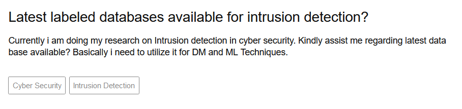

# Magicwand Data Tool

**PCAP generation platform to facilitate machine learning model development for identifying benign traffic vs. malicious "low volume" denial of service traffic.**

## What is Magicwand

Magicwand is a platform to provide high-quality, reliable, and reproducible data sets for low-and-slow DDoS attacks. With the use of Docker images and customizable JSON files, users can generate a multitude of network traffic PCAPS.

For complete documentation on Magicwand, a gallery of available attacks, the configuration guide, tutorials, and teaching resources, frequently asked questions, and more, please read our [documentation](https://magicwand-datatool.readthedocs.io/en/latest/).

### What is a "low and slow" DDoS

Low and slow attacks stealthily degrade server performance through cleverly crafted transmissions of data. A normal DDoS uses volumetric transmissions to overwhelm a server.

## Why develop Magicwand

In the network security space, questions like these are common amongst researchers...

> 


Network security datasets are hard to come by due to data privacy concerns. This struggle to capture live traffic and use it for research purposes is limited to very static and unreproducible datasets provided on an ad-hoc basis. To fix the stale dataset problem, we have developed Magicwand, as we to provide researchers with high quality data they can use for network security analysis.

## Installing Magicwand

### Dependencies

The following are dependencies need to properly run Magicwand

* docker (https://docs.docker.com/get-docker/)
* docker-compose (https://docs.docker.com/compose/install/)
* python3.6+ (https://www.python.org/downloads/)
* tshark (https://www.wireshark.org/docs/man-pages/tshark.html)

### Hardware Requirements

* >= 8GB of RAM
* >= 2 CPUS

### Installing Magicwand

Magicwand is compatible with Python 3.6 or later. The simplest way to install Magicwand and its dependencies is from PyPI with pip, Python's preferred package installer.

```bash
pip install magicwand
```

Note that Magicwand is an active project and routinely publishes new releases. In order to upgrade Magicwand to the latest version, use pip as follows

```bash
pip install -U magicwand
```

Magicwand can also be installed from source.

```bash
make -C magicwand-data-generator/ install
```

In addition to the python package, Magicwand leverages prebuilt docker images to run experiments

You can pull from docker hub

```bash
bash scripts/pull_images.sh
```

### Quick Start

Here's how you can quickly use magicwand

### 1. Install Magicwand CLI Tool

```bash
pip install magicwand
```

### 2. Create Test Folder

```bash
magicwand init --project test
cd test
```

### 3. Run Calibration Command
``` bash
magicwand calibrate --attack apachekill
```

### 4. Start Runs
```bash
magicwand run --config configs/mw_locust-apachekill.json --count 1 --data_version test_runs
```

For complete documentation on Magicwand, a gallery of available attacks, the configuration guide, tutorials and teaching resources, frequently asked questions, and more, please visit our [documentation](https://magicwand-datatool.readthedocs.io/en/latest/).

## Contributing to Magicwand

Magicwand is an open source project that is supported by a community who will gratefully and humbly accept any contributions you might make to the project. Large or small, any contribution makes a big difference; and if you've never contributed to an open source project before, we hope you will start with Magicwand!

If you are interested in contributing, check out our contributor's guide. Here are some of the many ways to contribute:

* Submit a bug report or feature request on GitHub Issues.
* Assist us with user testing.
* Add a new attack to our repository
* Add to the documentation or help with our website,
* Write unit or integration tests for our project.
* Answer questions on our issues, mailing list, Stack Overflow, and elsewhere.
* Translate our documentation into another language.
* Write a blog post, tweet, or share our project with others.
* Teach someone how to use Magicwand.

As you can see, there are lots of ways to get involved and we would be very happy for you to join us! The only thing we ask is that you abide by the principles of openness, respect, and consideration of others as described in the Python Software Foundation Code of Conduct.

For more information, checkout the [CONTRIBUTING.md](CONTRIBUTING.md) file in the root of the repository.

## Magicwand Datasets
TODO: We should host some PCAPS/CSVs somewhere for people to use https://osf.io/? or an s3 bucket?

## Citing Magicwand

We would be glad if you used Magicwand in your scientific publications! If you do, please cite us using the citation guidelines.

## Affiliations


