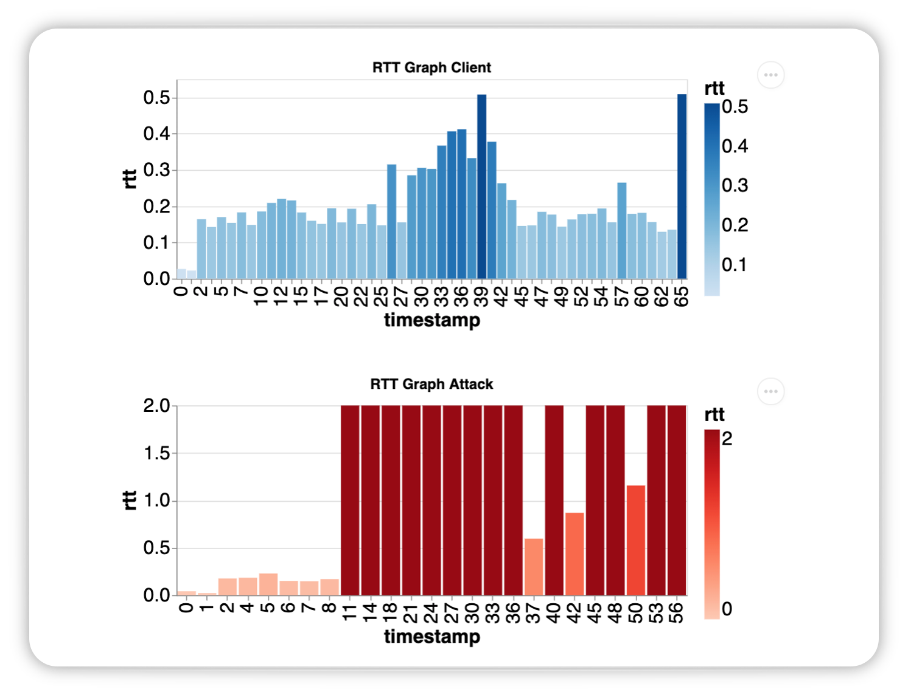

# MAGICWAND Data Generator

<!--  -->

## What is Magicwand

Magicwand is a platform to provide high-quality, reliable, and reproducible data sets for low-and-slow DDoS attacks. With the use of Docker images and customizable JSON files, users can generate a multitude of network traffic PCAPS.

Data is generated by orchestrating configurable test with both benign and attack traffic targeting a system under test (SUT) using Docker on the user's machine.

Resulting data includes PCAP captures, experiment metadata, the SUT resource/consumption metrics, and more; data is stored locally with machine learning model development in mind.

## Getting Started

This guide will walk through the basics of starting your first Magicwand experiment and producing your first PCAP.

Before you get started, you’re going to need a few things:


* [docker](https://docs.docker.com/get-docker/)
* [docker-compose](https://docs.docker.com/compose/install/)
* [python3.6+](https://www.python.org/downloads/)
* [tshark](https://www.wireshark.org/docs/man-pages/tshark.html)


### Hardware Requirements
Magicwand experiments consume a considerable amount of system resources, so we recommend that your machine has at least 8GB of RAM and 2 CPUS


## Installing Magicwand
Magicwand is compatible with Python 3.6 or later. The simplest way to install Magicwand and its dependencies is from PyPI with pip, Python's preferred package installer.

```bash
$ pip install magicwand
```
Note that Magicwand is an active project and routinely publishes new releases. In order to upgrade Magicwand to the latest version, use pip as follows

```bash
$ pip install -U magicwand
```
In addition to the python package, Magicwand leverages prebuilt docker images to run experiments


 You can build the images by running

```bash
$ bash images/build_all.sh
```


## Using Magicwand

The Magicwand CLI provides a streamlined methodology to generate reproducible network traffic data. This section will walk through how we setup an experiment and produce data.

### Initialize your Experiment

To begin we must first initialize your experiment directory. 

```bash
$ magicwand init --folder test_magicwand
$ cd test_magicwand
```

This will create a new folder called test_magicwand with all the required configuration/orchestration files needed to run experiments on your local machine.

To learn more visit the [CLI page](cli.md##initialize-project-init) for further details.


### Calibrate Your Machine

After our experiment directory is created, we can now calibrate the attacks to create the desired effect based on your hardware resources. This is an optional step, but it does allow us to verify that your machine can run magicwand experiments. To learn more about the calibration process and methodology view the [Calibration page](calibration.md) for further details.

To start simply run

```bash
$ magicwand calibrate --attack apachekill
```

This command will roughly take 5 minutes to complete. It will run two experiments one with benign traffic only and one with attack traffic only. The goal is to see if the apache server is being affected in the desired way, with only one type of traffic. Once complete the calibrate JSON will be saved in the tuned_jsons folder. 

This is an example output from calibration.

```bash
#Example Output
2020-10-28 17:29:27,197 | INFO : Running calibration for: apachekill
2020-10-28 17:29:27,201 - INFO -  mw-log - Starting runs for data version: mw_calibrate_runs
2020-10-28 17:29:27,204 - INFO -  mw-log - Running for 150 seconds
Creating network "suts_default" with the default driver
Creating suts_mw-sut-apachewp_1 ... done
Creating suts_mw-client-rtt-tracker_1 ... done
Creating suts_mw-client-smartswarm_1  ... done
Stopping suts_mw-client-smartswarm_1  ... done
Stopping suts_mw-client-rtt-tracker_1 ... done
Stopping suts_mw-sut-apachewp_1       ... done
Removing suts_mw-client-smartswarm_1  ... done
Removing suts_mw-client-rtt-tracker_1 ... done
Removing suts_mw-sut-apachewp_1       ... done
Removing network suts_default
Running cfm
cic.cs.unb.ca.ifm.Cmd You select: /home/tcpdump.pcap
cic.cs.unb.ca.ifm.Cmd Out folder: /home
cic.cs.unb.ca.ifm.Cmd CICFlowMeter received 1 pcap file
Working on... tcpdump.pcap
tcpdump.pcap is done. total 360 flows 
Packet stats: Total=8570,Valid=8545,Discarded=25
-------------------------------------------------------------------------------
Done
2020-10-28 17:32:30,338 - INFO -  mw-log - Benign Stats:
2020-10-28 17:32:30,339 - INFO -  mw-log - 358 flows out of 359 flows: 1.0
2020-10-28 17:32:30,339 - INFO -  mw-log - Attack Stats:
2020-10-28 17:32:30,339 - INFO -  mw-log - 0 flows out of 359 flows: 0.0
2020-10-28 17:32:30,361 - INFO -  mw-log - Finished Run 1 Successfully
2020-10-28 17:32:30,368 - INFO -  mw-log - Starting runs for data version: mw_calibrate_runs
2020-10-28 17:32:30,370 - INFO -  mw-log - Running for 150 seconds
Creating network "suts_default" with the default driver
Creating suts_mw-sut-apachewp_1 ... done
Creating suts_mw-attack-apachekill_1  ... done
Creating suts_mw-client-rtt-tracker_1 ... done
Stopping suts_mw-attack-apachekill_1  ... done
Stopping suts_mw-client-rtt-tracker_1 ... done
Stopping suts_mw-sut-apachewp_1       ... done
Removing suts_mw-attack-apachekill_1  ... done
Removing suts_mw-client-rtt-tracker_1 ... done
Removing suts_mw-sut-apachewp_1       ... done
Removing network suts_default
Running cfm
cic.cs.unb.ca.ifm.Cmd You select: /home/tcpdump.pcap
cic.cs.unb.ca.ifm.Cmd Out folder: /home
cic.cs.unb.ca.ifm.Cmd CICFlowMeter received 1 pcap file
Working on... tcpdump.pcap
tcpdump.pcap is done. total 4461 flows 
Packet stats: Total=28584,Valid=28559,Discarded=25
-------------------------------------------------------------------------------
Done
2020-10-28 17:35:43,252 - INFO -  mw-log - Benign Stats:
2020-10-28 17:35:43,253 - INFO -  mw-log - 234 flows out of 4460 flows: 0.05
2020-10-28 17:35:43,253 - INFO -  mw-log - Attack Stats:
2020-10-28 17:35:43,253 - INFO -  mw-log - 4225 flows out of 4460 flows: 0.95
2020-10-28 17:35:43,517 - INFO -  mw-log - Finished Run 1 Successfully
2020-10-28 17:35:43,555 - INFO -  mw-log - Checking results...
2020-10-28 17:35:43,555 - INFO -  mw-log - Calibration Completed Successfully
2020-10-28 17:35:43,562 - INFO -  mw-log - Calibration Process Finished
```

### Run Your Experiment

Now we are ready run out first experiment. To start simply invoke the ```run``` command as follows

```bash
$ magicwand run --config configs/mw_locust-apachekill.json --count 1 --data_version apachekill_runs 
```

This will start one run using the apachekill attack configuration and save the results to ```data_runs/apachekill_runs```
This command will roughly take 5 minutes to complete, here is some example output

```bash
2020-09-01 13:03:02,463 - INFO -  mw-log - Starting runs for data version: test_runs
2020-09-01 13:03:02,463 - INFO -  mw-log - Running for 300 seconds
Creating network "run_configs_default" with the default driver
Creating run_configs_mw-sut-apachewp_1 ... done
Creating run_configs_mw-attack-apachekill_1  ... done
Creating run_configs_mw-client-rtt-tracker_1 ... done
Creating run_configs_mw-client-smartswarm_1  ... done
Stopping run_configs_mw-client-rtt-tracker_1 ... done
Stopping run_configs_mw-client-smartswarm_1  ... done
Stopping run_configs_mw-attack-apachekill_1  ... done
Stopping run_configs_mw-sut-apachewp_1       ... done
Removing run_configs_mw-client-rtt-tracker_1 ... done
Removing run_configs_mw-client-smartswarm_1  ... done
Removing run_configs_mw-attack-apachekill_1  ... done
Removing run_configs_mw-sut-apachewp_1       ... done
Removing network run_configs_default
Running cfm
cic.cs.unb.ca.ifm.Cmd You select: /home/tcpdump.pcap
cic.cs.unb.ca.ifm.Cmd Out folder: /home
cic.cs.unb.ca.ifm.Cmd CICFlowMeter received 1 pcap file
Working on... tcpdump.pcap
tcpdump.pcap is done. total 4461 flows 
Packet stats: Total=28584,Valid=28559,Discarded=25
-------------------------------------------------------------------------------
Done
2020-10-28 17:35:43,252 - INFO -  mw-log - Benign Stats:
2020-10-28 17:35:43,253 - INFO -  mw-log - 234 flows out of 4460 flows: 0.05
2020-10-28 17:35:43,253 - INFO -  mw-log - Attack Stats:
2020-10-28 17:35:43,253 - INFO -  mw-log - 4225 flows out of 4460 flows: 0.95
2020-09-01 13:04:04,998 - INFO -  mw-log - Finished Run 1 Successfully
2020-09-01 13:05:26,552 - INFO -  mw-log - ALL IPs present
2020-09-01 13:06:36,705 - INFO -  mw-log - All verifications passed
2020-09-01 13:07:41,509 - INFO -  mw-log - Run Process Finished
```

Once finished we can view the output files in the folder ```data_runs/apachekill_run/*/```

```
$ ls data_runs/apachekill_run/*/
apache_stats.csv        ip_map_client.csv       mem_stats.csv           tcpdump.pcap
cic_flow_labeled.csv    ip_map_rtt.csv          rtt_stats.csv           tcpdump.pcap_Flow.csv
ip_attr_map.csv         ip_map_sut.csv          run_config.json         tcpdump_verify.csv
ip_map_attack.csv       locust_4ce7ab68e5df.csv run_parms.json          verify_run.json
```

To learn more about each file visit the [Data page](data.md#) for further details.
To learn more about the run command visit the [CLI page](cli.md#execute-run-run) for further details.


## Advanced Usage

The follow section will walk through running advanced experiments. 

### Changing Configurations

The configurations files are very flexible allowing you to change up the parameters to fit your use case. To edit the overall run, you will edit the JSON file in the configs folder. To edit each component, you edit the files in the magicwand_components directory.


This section will show you some example configurations to produce a variety of PCAPs. To see the full configuration options visit the [Configuration page](config.md) for further details.

#### No Attack Experiment

To generate a PCAP without attack traffic simply remove the attack parameter from the JSON file. 
The JSON file provided is an example to do a no attack experiment.

`configs/mw_locust-only.json`
```
{
    "benign": "mw_locust",
    "sut": "mw_apache_wp",
    "rtt": "mw_rtt_sensor",
    "run_type": "mw-locust-only"
}
```

#### 60 second Sockstress attack with staggered clients

This configuration will have Sockstress run for the first 60 seconds, and then stop, while the clients continue to ping server.

`configs/mw_locust-sockstress.json`
```
{
    "attack": "sockstress",
    "benign": "mw_locust",
    "sut": "mw_apache_wp",
    "rtt": "mw_rtt_sensor",
    "run_type": "mw-locust-sockstress"
}
```

`magicwand_components/benign/mw_locust.json`
```
{"client_options": {"stagger":"ON","num_ips": 20, "client_duration": 300, "locust_duration": 60, "wait_max": 60, "seed": "None"}, "benign": "mw_locust", "compose-file": "magicwand_components/benign/mw_locust.yml"}
```


`magicwand_components/attacks/sockstress.json`

```
{"attack_options": {"packet_delay": 5000, "attack_duration": 60, "attack_delay": 15}, "attack": "sockstress", "compose-file": "magicwand_components/attacks/sockstress.yml"}

```

#### Client Keepalive Random Experiment Slowread 

This configuration will have a Slowread attack, and locust clients that will randomly send HTTP keepalive on or off messages to the server. 


```configs/mw_locust-sht_slowread.json```
```
{
    "attack": "sht_slowread",
    "benign": "mw_locust",
    "sut": "mw_apache_wp",
    "rtt": "mw_rtt_sensor",
    "run_type": "mw-locust-sht_slowread"
}
```

`magicwand_components/benign/mw_locust.json`
```
{"client_options": {"stagger":"ON","num_ips": 20, "client_duration": 300, "locust_duration": 60, "wait_max": 60 "keepalive":"RANDOM"}, "benign": "mw_locust", "compose-file": "magicwand_components/benign/mw_locust.yml"}
```


`magicwand_components/attacks/sht_slowread.json`
```
{"attack_options": {"connections_per_sec": 256, "attack_duration": 300, "num_connections": 16384,"attack_delay": 15}, "attack": "sht_slowread", "compose-file": "magicwand_components/attacks/sht_slowread.yml"}
```
